#神奇的canvas

# 第1章 canvas简介

***1. 什么是canvas？（了解）***

```html
<canvas></canvas>
英 ['kænvəs]  美 ['kænvəs]   帆布 画布
```
+ 是**HTML5**提供的一种新标签
+ Canvas是一个矩形区域的画布，可以**用JavaScript在上面绘画**。控制其每一个像素。
+ canvas 标签使用 JavaScript 在网页上绘制图像，**本身不具备绘图功能**。
+ canvas 拥有多种绘制路径、矩形、圆形、字符以及添加图像的方法。
+ HTML5之前的web页面**只能用一些固定样式的标签：比如 p、div、h1 等**
       

***2. canvas主要应用的领域（了解）***  

1. 游戏：canvas在基于Web的图像显示方面比Flash更加立体、更加精巧，canvas游戏在流畅度和跨平台方面更牛。      
    [25 超棒的 HTML5 Canvas 游戏](http://www.oschina.net/news/20143/top-25-best-html5-canvas-games-you-love-to-play)
2. **可视化数据**：数据图表话，比如:[百度的echart](http://echarts.baidu.com/)    
3. **banner广告**：Flash曾经辉煌的时代，智能手机还未曾出现。现在以及未来的智能机时代，HTML5技术能够在banner广告上发挥巨大作用，用Canvas实现动态的广告效果再合适不过。
4. 未来=> 模拟器：无论从视觉效果还是核心功能方面来说，模拟器产品可以完全由JavaScript来实现。
5. 未来=> 远程计算机控制：Canvas可以让开发者更好地实现基于Web的数据传输，构建一个完美的可视化控制界面。
6. 未来=> 图形编辑器：Photoshop图形编辑器将能够100%基于Web实现。
7. 其他可嵌入网站的内容(多用于活动页面、特效)：类似图表、音频、视频，还有许多元素能够更好地与Web融合，并且不需要任何插件。
8. **完整的canvas移动化应用**

***3. 我们课程的目标***

+ 我们不是主要做游戏开发的
+ 要求必须会做基本的用canvas绘制的特效页面：比如，传智前端官网。
+ 会用canvas做一些简单的广告、活动页面

canvas的标准： 
+ 最新标准：http://www.w3.org/TR/2dcontext/
+ 稳定版本的标准：http://www.w3.org/TR/2013/CR-2dcontext-20130806/
+ 目前来说，标准还在完善中。先用早期的api足够完成所有的应用

-------------

# 第2章 canvas绘图基础

## 2.1 canvas标签

***1. canvas标签语法和属性（重点）***     

+ canvas：画布油布的意思 ==英 ['kænvəs]   美 ['kænvəs] ==
+ 标签名canvas，需要进行闭合。就是一普通的html标签。

**注意：**

设置canvas标签的宽和高：

+ 可以设置width和height属性，**不能用比例去设置**，但是属性值**单位必须是px**，否则忽略。****
  + width和hegiht：默认300*150像素

* 不要用CSS控制它的宽和高,会走出图片拉伸，
* 重新设置canvas标签的宽高属性会让画布擦除所有的内容。
* 可以给canvas画布设置背景色

***2. 浏览器不兼容处理（重点）***

+ **ie9**以上才支持canvas, 其他chrome、ff、苹果浏览器等都支持
+ 只要浏览器兼容canvas，那么就会支持绝大部分api(个别最新api除外)
+ **移动端**的兼容情况非常理想，基本上随便使用
+ 2d的支持的都非常好，3d（webgl）ie11才支持，其他都支持
+ 如果浏览器不兼容，最好进行友好提示         
```html
 <canvas id="cavsElem">
   你的浏览器不支持canvas，请升级浏览器.浏览器不支持，显示此行文本
</canvas>
```
+ 浏览器不兼容，可以使用*flash*等手段进行**优雅降级**


## 2.2 canvas绘图上下文context

***1. context：canvas的上下文、绘制环境。（重点掌握）***

+ 除语法外另外一个重要的地方
+ 上下文：上知天文，下知地理。是所有的绘制操作api的入口或者集合。
+ Canvas自身无法绘制任何内容。Canvas的绘图是使用JavaScript操作的。
+ **Context对象**就是JavaScript操作Canvas的接口。使用[CanvasElement].getContext(‘2d’)来获取2D绘图上下文。        

***2. 如何获取context对象？***

使用`[CanvasElement].getContext(‘2d’)`来获取2D绘图上下文。        

```js
var canvas  = document.getElementById( 'cavsElem' ); //获得画布
var ctx = canvas.getContext( '2d' );//注意：2d小写， 3d：webgl
```

## 2.3 基本的绘制路径（重点）
***1. canvas坐标系***

canvas坐标系，从最左上角0,0开始。x向右增大， y向下增大

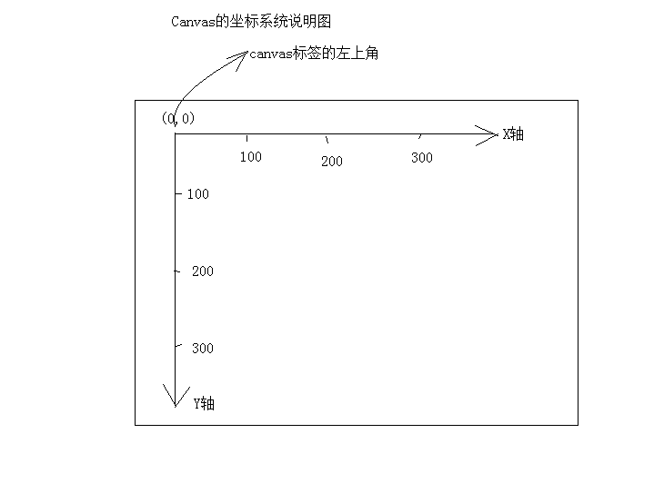

***2. canvas绘制的基本步骤：***

1. 获得上下文 =>canvasElem.getContext('2d');
2. 开始路径规划 =>ctx.beginPath()
3. 移动起始点 =>ctx.moveTo(x, y)
4. 绘制线(矩形、圆形、图片...) =>ctx.lineTo(x, y)
5. 闭合路径 =>ctx.closePath();
6. 绘制描边 =>ctx.stroke();

***3. 设置绘制起点(moveTo)***

|      |                                                    |
| ---- | -------------------------------------------------- |
| 语法 | ctx.`moveTo(x, y)`;                                |
| 解释 | 设置上下文绘制路径的起点。相当于移动画笔到某个位置 |
| 参数 | x,y 都是相对于 canvas盒子的最左上角。              |
| 注意 | **绘制线段前必须先设置起点。**                     |

***4. 绘制直线(lineTo)***

|      |                                                 |
| ---- | ----------------------------------------------- |
| 语法 | ctx.`lineTo(x, y)`;                             |
| 解释 | 从x,y的位置绘制一条直线到起点或者上一个线头点。 |
| 参数 | x,y 线头点坐标。                                |

***5. 路径开始和闭合***

|      |                                                              |
| ---- | ------------------------------------------------------------ |
| 语法 | ctx.`beginPath()`;                                           |
| 解释 | 如果是绘制不同状态的线段或者形状，必须使用开始新路径的方法把不同的绘制操作隔开。 |

核心的作用是：将不同绘制的形状进行隔离。每次执行此方法，表示重新绘制一个路径，跟之前的绘制的墨迹可以进行分开样式设置和管理。

|      |                                                  |
| ---- | ------------------------------------------------ |
| 语法 | ctx.`closePath()`;                               |
| 解释 | 闭合路径会自动把最后的线头和开始的线头连在一起。 |

***6. 描边(stroke)***

|      |                                                        |
| ---- | ------------------------------------------------------ |
| 语法 | ctx.`stroke()`;                                        |
| 解释 | 根据路径绘制线。路径只是草稿，真正绘制线必须执行stroke |

stroke: （用笔等）画；轻抚；轻挪；敲击；划尾桨；划掉；（打字时）击打键盘
 英 [strəʊk]   美 [strok]

html部分：

```html
 <canvas id="cavsElem">
   你的浏览器不支持canvas，请升级浏览器
</canvas>
```

js部分：

```js
//===============基本绘制api====================
//获得画布
var canvas = document.querySelector('#cavsElem');
var ctx = canvas.getContext('2d');  //获得上下文

canvas.width = 900;     //设置标签的属性宽高
canvas.height = 600;    //千万不要用 canvas.style.height
canvas.style.border = "1px solid #000";

//绘制三角形
ctx.beginPath();        //开始路径
ctx.moveTo(100,100);    //三角形，左顶点
ctx.lineTo(300, 100);   //右顶点
ctx.lineTo(300, 300);   //底部的点
ctx.closePath();        //结束路径
ctx.stroke();           //描边路径
```

+ 综合案例：02绘制定位表格.html
+ 综合案例：03画画板.html

***7. 填充（fill）***

|      |                                                              |
| ---- | ------------------------------------------------------------ |
| 语法 | ctx.`fill()`;                                                |
| 解释 | 填充，是将闭合的路径的内容填充具体的颜色。默认黑色。         |
| 注意 | **交叉路径**的填充问题“**非零环绕原则**”，顺逆时针穿插次数决定是否填充。 |

以下是非0环绕原则的原理：（了解即可，非常少会用到复杂的路径）

对于路径中的任意给定区域，从该区域内部画一条足够长的线段， 使此线段的终点完全落在路径范围之外。 图2-14中的那三个箭头所描述的就是上面这个步骤。 接下来，将计数器初始化为0， 然后，每当这条线段与路径上的直线或曲线相交时， 就改变计数器的值。如果是与路径的顺时针部分相交，则加1， 如果是与路径的逆时针部分相交，则减1。若计数器的最终值不是0，那么此区域就在路径里面，在调用fill()方法时， 浏览器就会对其进行填充。 如果最终值是0，那么此区域就不在路径内部，浏览器也就不会对其进行填充了

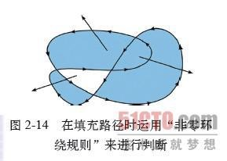

###2.3.1 理解立即执行函数

***1. 闭包***

理解闭包的关键在于：**外部函数调用之后其变量对象本应该被销毁，但闭包的存在使我们仍然可以访问外部函数的变量对象**，这就是闭包的重要概念。

[面试官问我：什么是JavaScript闭包，我该如何回答？](https://www.jianshu.com/p/102e44f35b3b)

-------------

 [闭包](https://www.liaoxuefeng.com/wiki/1022910821149312/1023021250770016)

----------

***2. 理解立即执行函数***

创建一个匿名函数 并 执行

```js
var a = function () {
  console.log('aa')
}
a()
```

创建一个匿名函数 并 立刻执行

理论上讲，创建一个匿名函数并立刻执行可以这么写：

```js
function(){}()//1、前面（）代表强制返回function(){}的函数对象
```

- **不加'()'**，JS会把他识别成**函数声明**
- **加'()'**，JS会把他识别成**函数表达式**

由于JavaScript**语法解析的问题**，会报SyntaxError错误。因此需要用括号把整个函数定义括起来：

- 立即执行（**括号表示执行**）函数表达式

  ```js
  (function(){})() //1、前面（）代表强制返回function(){}的函数对象
  ```

- 立即执行（**括号表示执行**）函数表达式的执行

  ```js
  (function(){}()) //2、最外层的（）代表强制返回function(){}()的函数对象，而其立即执行
  ```

## 2.4 绘制矩形（rect）

***1. 快速创建矩形***

|      |                                                  |
| ---- | ------------------------------------------------ |
| 语法 | ctx.`rect(x, y, width, height)`;                 |
| 解释 | x, y是矩形左上角坐标， width和height都是以像素计 |

rect方法只是规划了矩形的路径，并没有填充和描边。

rect: abbr. 矩形（rectangular）；收据（receipt）

改造案例：04填充矩形.html

***2. 描边矩形(strokeRect)和填充矩形(fillRect)***

|      |                                       |
| ---- | ------------------------------------- |
| 语法 | ctx.strokeRect(x,  y, width, height); |
| 解释 | 绘制完路径后立即进行stroke绘制        |

|      |                                    |
| ---- | ---------------------------------- |
| 语法 | ctx.fillRect(x, y, width, height); |
| 解释 | 绘制完路径后立即进行fill填充       |

***3. 清除矩形***

|      |                                            |
| ---- | ------------------------------------------ |
| 语法 | ctx.clearRect(x, y, width, hegiht);        |
| 解释 | 清除某个矩形内的绘制的内容，相当于橡皮擦。 |

## 2.4 绘制圆形（arc)  

|      |                                                              |
| ---- | ------------------------------------------------------------ |
| 语法 | ctx.arc(x,y,r,sAngle,eAngle,counterclockwise);               |
| 解释 | 创建弧/曲线（用于创建圆或部分圆）。                          |
| 参数 | \- x,y：圆心坐标。<br />\- r：半径大小。<br />\- sAngle,eAngel：绘制开始的角度。 圆心到最右边点是 0 度，顺时针方向弧度增大<br />\- counterclockwise：是否是逆时针。true逆时针，false顺时针 |
| 注意 | **是弧度π**，弧度和角度的转换公式： rad = deg*Math.PI/180;<br />在 Math 提供的方法中**sin、cos 等都使用的弧度** |

arc:  弧（度）弧形物；天穹 英 [ɑːk]   美 [ɑrk]

counter：反击，还击；反向移动，对着干；反驳，回答  ['kaʊntə]   美 ['kaʊntɚ]

   

+ 案例：05绘制圆形.html
+ 案例：06绘制饼状图.html 

## 2.5 绘制文字（会使用就可以了）
***1. 绘制上下文的文字属性 （有印象就行了）*** 

***1. 绘制***

|      |                                  |
| ---- | -------------------------------- |
| 语法 | ctx.font                         |
| 解释 | 设置或返回文本内容的当前字体属性 |
| 参数 | 使用的语法与 CSS font 属性相同   |

```js
ctx.font = "18px '微软雅黑'";
```

|      |                                                              |
| ---- | ------------------------------------------------------------ |
| 语法 | ctx.textAlign                                                |
| 解释 | 设置或返回文本内容的当前对齐方式                             |
| 参数 | start : 默认。文本在指定的位置开始。<br />end : 文本在指定的位置结束。<br />center: 文本的中心被放置在指定的位置。<br />left : 文本左对齐。<br />right : 文本右对齐。 |

```js
ctx.textAlign = 'left'; 
```

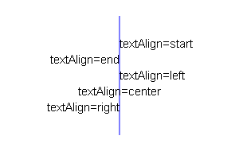

|      |                                                              |
| ---- | ------------------------------------------------------------ |
| 语法 | ctx.textBaseline                                             |
| 解释 | 设置或返回在绘制文本时使用的当前文本基线                     |
| 参数 | alphabetic ： 默认。文本基线是普通的字母基线。<br />top ： 文本基线是 em 方框的顶端。<br />hanging ： 文本基线是悬挂基线。<br />middle ： 文本基线是 em 方框的正中。<br />ideographic： 文本基线是 em 基线。<br />bottom ： 文本基线是 em 方框的底端。 |

alphabetic: 字母的；照字母次序的 [,ælfə'bɛtɪk] 

ideographic：表意的；表意字构成的 英 [,ɪdɪəʊ'ɡræfɪk] 美 [,ɪdɪə'græfɪk]

```js
ctx.textBaseline = 'top';
```

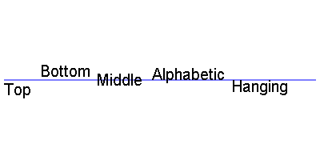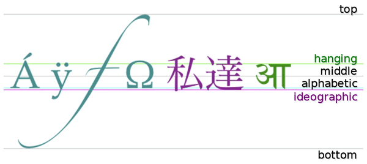  

***2. 绘制文字方法***

|      |                            |
| ---- | -------------------------- |
| 语法 | ctx.fillText()             |
| 解释 | 在画布上绘制“被填充的”文本 |

|      |                            |
| ---- | -------------------------- |
| 语法 | ctx.strokeText()           |
| 解释 | 在画布上绘制文本（无填充） |

|      |                            |
| ---- | -------------------------- |
| 语法 | ctx.measureText()          |
| 解释 | 返回包含指定文本宽度的对象 |

measure 测量；估量；权衡 英 ['meʒə] 美 ['mɛʒɚ]

```js
//综合案例代码：
ctx.moveTo( 300, 300 );
ctx.fillStyle = "purple";               //设置填充颜色为紫色
ctx.font = '20px "微软雅黑"';           //设置字体
ctx.textBaseline = "bottom";            //设置字体底线对齐绘制基线
ctx.textAlign = "left";                 //设置字体对齐的方式
//ctx.strokeText( "left", 450, 400 );
ctx.fillText( "Top-g", 100, 300 );        //填充文字
```

- 案例07文字绘制.html

## 2.6 绘制图片（drawImage）  （重点）

***1. 绘制图片（drawImage）***

|      |                                                            |
| ---- | ---------------------------------------------------------- |
| 语法 | ctx.drawImage(img,x,y);                                    |
| 解释 | 基本绘制图片的方式                                         |
| 参数 | img是绘制图片的**dom对象**。<br />x,y 绘制图片左上角的坐标 |

|      |                                                              |
| ---- | ------------------------------------------------------------ |
| 语法 | ctx.drawImage(img,x,y,width,height);                         |
| 解释 | 在画布上绘制图像，并规定图像的宽度和高度                     |
| 参数 | width 绘制图片的宽度，<br />height：绘制图片的高度           |
| 注意 | 如果指定宽高，最好成比例，不然图片会被拉伸<br />**等比公式**： toH = Height * toW / Width; //等比 设置高 = 原高度 * 设置宽/ 原宽度; |

|      |                                                              |
| ---- | ------------------------------------------------------------ |
| 语法 | ctx.drawImage(img,sx,sy,swidth,sheight,x,y,width,height);    |
| 解释 | 图片裁剪，并在画布上定位被剪切的部分                         |
| 参数 | sx,sy 裁剪的左上角坐标，<br />swidth：裁剪图片的高度。 <br />sheight：裁剪的高度 其他同上 |

***2. 用JavaScript创建img对象***

- 第一种方式：

  ```js
  var img = document.getElementById("imgId");
  ```

- 第二种方式：

  ```js
  var img = new Image();//这个就是 img标签的dom对象
  img.src = "imgs/arc.gif";
  img.alt = "文本信息";
  img.onload = function() {
  //图片加载完成后，执行此方法
  }    
  ```

### 2.6.1 理解面向对象
***1. 创建对象的方式：***

1. json方式创建

   ```js
   var o = { name: '123', age: 18 }; //json方式创建
   ```

2. 通过new的方式创建

   ```js
   var o = new Object();  //通过new的方式创建
   ```

3. 通过类的构造函数创建

   ```js
   var o = new Persion(); //通过类的构造函数创建
   ```

***2. JS中对象的属性创建方式***

1. json的方式：

   ```js
   var o = { age: 19 };
   ```

2. 直接添加属性：

   ```js
   var o = {};  o.age = 19;//太分散了，不利于管理
   ```

由于js动态语言的特性，如果属性不存在的时候，直接添加属性。

1. 构造函数添加属性
2. **原型**添加**公共的属性**

***3. JS的构造函数的原型***

构造函数的**原型**就是：**构造对象的模板**

构造函数原型里面的所有的属性和方法都会共享给所有的 构造函数构造出来的所有实例。
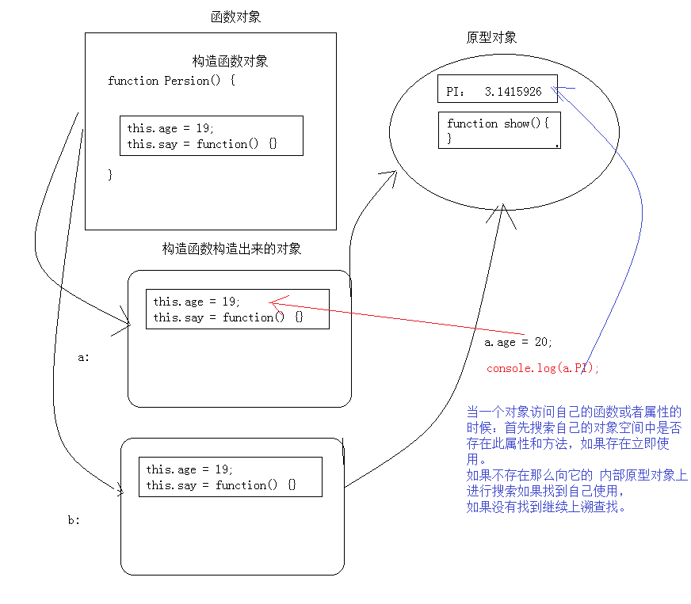

+ 案例： 08绘制图片.html
+ 案例： 09绘制图片裁剪.html
+ 案例： 10序列帧动画.html
+ 案例： 11面向对象版本的动画帧.html  **重点**

-------------

# 第3章 canvas进阶

## 3.1 Canvas颜色样式和阴影

***1. 设置填充和描边的颜色（掌握）***

|      |                              |
| ---- | ---------------------------- |
| 语法 | ctx.fillStyle                |
| 解释 | 设置或返回用于填充绘画的颜色 |

|      |                 |
| ---- | --------------- |
| 语法 | ctx.strokeStyle |
| 解释 | ctx.strokeStyle |

以上两个值都可以接受颜色名,16进制数据，rgb值，甚至rgba.

先进行设置样式，然后进行绘制。

```js
ctx.strokeStyle = "red";      
ctx.strokeStyle = "#ccc";      
ctx.strokeStyle = "rgb(255,0,0)";      
ctx.strokeStyle = "rgba(255,0,0,6)";    
```

***2. 设置阴影（了解，少用，性能差）***

|      |                          |
| ---- | ------------------------ |
| 语法 | ctx.shadowColor          |
| 解释 | 设置或返回用于阴影的颜色 |

|      |                                                              |
| ---- | ------------------------------------------------------------ |
| 语法 | ctx.shadowBlur                                               |
| 解释 | 设置或返回用于阴影的模糊级别,大于 1 的正整数，数值越高，模糊程度越大 |

|      |                                |
| ---- | ------------------------------ |
| 语法 | ctx.shadowOffsetX              |
| 解释 | 设置或返回阴影距形状的水平距离 |

|      |                                |
| ---- | ------------------------------ |
| 语法 | ctx.shadowOffsetY              |
| 解释 | 设置或返回阴影距形状的垂直距离 |

注意：

- 设置png图片的阴影，图片透明部分不会被投影。
- 类比于CSS3的阴影。

```js
ctx.fillStyle = "rgba(255,0,0, .9)"
ctx.shadowColor = "teal";
ctx.shadowBlur = 10;
ctx.shadowOffsetX = 10;
ctx.shadowOffsetY = 10;
ctx.fillRect(100, 100, 100, 100);
```
+ 案例： 12设置box盒子阴影.html


## 3.2 复杂样式（了解）

***1. 创建线性渐变的样式（了解）*** 

|      |                                                       |
| ---- | ----------------------------------------------------- |
| 语法 | ctx.createLinearGradient(x0,y0,x1,y1);                |
| 解释 | 创建线性渐变对象。可以用于 矩形、圆形、文字等颜色样式 |
| 参数 | x0,y0 起始坐标<br />x1,y1 结束坐标                    |
| 注意 | 一般不用，都是用图片代替，canvas绘制图片效率更高。    |

```js
//创建线性渐变的对象，
var grd=ctx.createLinearGradient(0,0,170,0);
grd.addColorStop(0,"black");  //添加一个渐变颜色，第一个参数介于 0.0 与 1.0 之间的值，表示渐变中开始与结束之间的位置。
grd.addColorStop(1,"white");  //添加一个渐变颜色
ctx.fillStyle =grd;           //关键点，把渐变设置到 填充的样式
```
- 案例13设置线性渐变.html


***2. 设置圆形渐变（径向渐变） 了解***

|      |                                                              |
| ---- | ------------------------------------------------------------ |
| 语法 | ctx.createRadialGradient(x0,y0,r0,x1,y1,r1);                 |
| 解释 | 创建放射状/圆形渐变对象。可以填充文本、形状等                |
| 参数 | x0：渐变的开始圆的 x 坐标<br />y0：渐变的开始圆的 y 坐标<br />r0：开始圆的半径<br />x1：渐变的结束圆的 x 坐标<br />y1：渐变的结束圆的 y 坐标<br />r1：结束圆的半径 |

radial   半径的；放射状的；光线的；光线状的   英 ['reɪdɪəl]   美 ['redɪəl]

```js
var rlg = ctx.createRadialGradient(300,300,10,300,300,200);
rlg.addColorStop(0, 'teal');    //添加一个渐变颜色
rlg.addColorStop(.4, 'navy');
rlg.addColorStop(1, 'purple');
ctx.fillStyle = rlg;//设置 填充样式为延续渐变的样式
ctx.fillRect(100, 100, 500, 500);
```
+ 案例14圆形渐变.html

***3. 绘制背景图（了解）***

|      |                                                              |
| ---- | ------------------------------------------------------------ |
| 语法 | ctx.createPattern(img,repeat);                               |
| 解释 | 在指定的方向内重复指定的元素                                 |
| 参数 | 第一参数：设置平铺背景的图片：<br />image ： 规定要使用的图片、**画布**或**视频元素**。<br />第二个背景平铺的方式：<br />repeat ： 默认。该模式在水平和垂直方向重复。<br />repeat-x ： 该模式只在水平方向重复。<br />repeat-y ： 该模式只在垂直方向重复。<br />no-repeat： 该模式只显示一次（不重复）。 |

pattern：n. 模式；图案；样品  英 ['pæt(ə)n]   美 ['pætɚn]

```js
var ctx=c.getContext("2d");
var img=document.getElementById("lamp");
var pat=ctx.createPattern(img,"repeat");
ctx.rect(0,0,150,100);
ctx.fillStyle=pat;//  把背景图设置给填充的样式
ctx.fill();
```
+ 案例15背景图填充.html

## 3.3 变换（重点）
***1. 缩放（重点）***

|      |                                                              |
| ---- | ------------------------------------------------------------ |
| 语法 | ctx.scale(scalewidth,scaleheight);                           |
| 解释 | 缩放当前绘图，更大或更小                                     |
| 参数 | scalewidth : 缩放当前绘图的宽度 (1=100%, 0.5=50%, 2=200%, 依次类推)<br />scaleheight : 缩放当前绘图的高度 (1=100%, 0.5=50%, 2=200%, etc.) |
| 注意 | 缩放的是整个画布，缩放后，继续绘制的图形会被放大或缩小。     |

+ 案例16缩放案例.html

***2. 位移画布（重点）***

|      |                                                              |
| ---- | ------------------------------------------------------------ |
| 语法 | ctx.translate(x,y);                                          |
| 解释 | 重新映射画布上的 (0,0) 位置                                  |
| 参数 | x： 添加到水平坐标（x）上的值<br />y： 添加到垂直坐标（y）上的值 |
| 注意 | 发生位移后，相当于把画布的0,0坐标 更换到新的x,y的位置，所有绘制的新元素都被影响。 |

位移画布一般配合缩放和旋转等。

+ 案例： 17位移画布.html

***3. 旋转（重点）***

|      |                                                              |
| ---- | ------------------------------------------------------------ |
| 语法 | ctx.rotate(angle);                                           |
| 解释 | 旋转当前的绘图                                               |
| 参数 | 弧度                                                         |
| 注意 | 参数是弧度（PI）<br />如需将角度转换为弧度，请使用 degrees*Math.PI/180 公式进行计算。 |

+ 案例：18旋转画布.html

## 3.3 绘制环境保存和还原（重要）

|      |                    |
| ---- | ------------------ |
| 语法 | ctx.save();        |
| 解释 | 保存当前环境的状态 |

可以把当前绘制环境进行保存到缓存中。

|      |                                |
| ---- | ------------------------------ |
| 语法 | ctx.restore();                 |
| 解释 | 返回之前保存过的路径状态和属性 |
| 注意 | 一般配合位移画布使用           |

获取最近缓存的 ctx

+ 案例： 19矩形旋转案例.html

## 3.4 设置绘制环境的透明度（了解）

|      |                                                              |
| ---- | ------------------------------------------------------------ |
| 语法 | ctx.globalAlpha=number;                                      |
| 解释 | 设置透明度是全局的透明度的样式。                             |
| 参数 | number:透明值。必须介于 0.0（完全透明） 与 1.0（不透明） 之间。 |
| 注意 | 注意是全局的。                                               |

+ context.globalAlpha=number;
+ number:透明值。必须介于 0.0（完全透明） 与 1.0（不透明） 之间。
+ 设置透明度是全局的透明度的样式。注意是全局的。

## 3.5 画布限定区域绘制（了解）

|      |                                |
| ---- | ------------------------------ |
| 语法 | ctx.clip();                    |
| 解释 | 从原始画布中剪切任意形状和尺寸 |
| 注意 | 一般配合绘制环境的保存和还原。 |

一旦剪切了某个区域，则所有之后的绘图都会被限制在被剪切的区域内（不能访问画布上的其他区域）

## 3.6 画布保存base64编码内容（重要）

|      |                                                              |
| ---- | ------------------------------------------------------------ |
| 语法 | ctx.toDataURL(type, encoderOptions);                         |
| 解释 | 把 canvas 绘制的内容输出成 base64 内容。                     |
| 参数 | type：设置输出的类型，比如 image/png image/jpeg 等<br />encoderOptions： 0-1 之间的数字，用于标识输出图片的质量，1 表示无损压缩，类型为： image/jpeg 或者 image/webp 才起作用。 |

```js
canvas.toDataURL("image/jpg",1);
```

```js
var canvas = document.getElementById("canvas");
var dataURL = canvas.toDataURL();
console.log(dataURL);
// "data:image/png;base64,iVBORw0KGgoAAAANSUhEUgAAAAUAAAAFCAYAAACNby
// blAAAADElEQVQImWNgoBMAAABpAAFEI8ARAAAAAElFTkSuQmCC"

var img = document.querySelector("#img-demo");//拿到图片的dom对象
img.src = canvas.toDataURL("image/png");      //将画布的内容给图片标签显示
```

## 3.7 画布渲染画布（重要）

|      |                                      |
| ---- | ------------------------------------ |
| 语法 | ctx.drawImage(img,x,y);              |
| 解释 | 把一个画布整体的渲染到另外一个画布上 |
| 参数 | img 参数也**可以是画布**             |

```js
var canvas1 = document.querySelector('#cavsElem1');
var canvas2 = document.querySelector('#cavsElem2');
var ctx1 = canvas1.getContext('2d');
var ctx2 = canvas2.getContext('2d');
ctx1.fillRect(20, 20, 40, 40);      //在第一个画布上绘制矩形

ctx2.drawImage(canvas1, 10, 10);    //将第一个画布整体绘制到第二个画布上
```

## 3.8 线条样式（了解）

|      |                                                              |
| ---- | ------------------------------------------------------------ |
| 语法 | ctx.lineCap                                                  |
| 解释 | 设置或返回线条的结束端点(线头、线冒)样式                     |
| 参数 | butt ： 默认。向线条的每个末端添加平直的边缘。<br />round ： 向线条的每个末端添加圆形线帽。<br />square： 向线条的每个末端添加正方形线帽。 |

butt 翻译.：屁股；烟头；笑柄；靶垛；粗大的一端 英 [bʌt] 美 [bʌt]

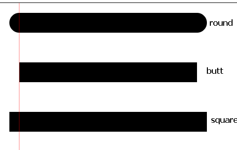  

- 参考：23线的样式.html

|      |                                                              |
| ---- | ------------------------------------------------------------ |
| 语法 | ctx.lineJoin                                                 |
| 解释 | 设置或返回两条线相交时，所创建的拐角类型                     |
| 参数 | bevel: 创建斜角。<br />round: 创建圆角。<br />miter: 默认。创建尖角 |

bevel- 翻译. 斜角；斜面；[测] 斜角规 英 ['bev(ə)l] 美 ['bɛvl]

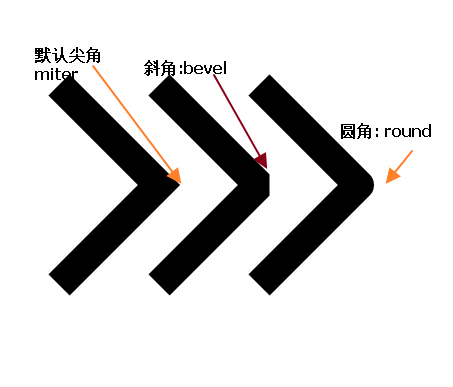

|      |                          |
| ---- | ------------------------ |
| 语法 | ctx.lineWidth            |
| 解释 | 设置或返回当前的线条宽度 |

|      |                                                              |
| ---- | ------------------------------------------------------------ |
| 语法 | ctx.miterLimit=2;                                            |
| 解释 | 设置或返回最大斜接长度                                       |
| 注意 | 一般用默认值：10就可以了。除非需要特别长的尖角时，使用此属性。 |

 miter 斜接 英 ['maɪtə]

斜接长度指的是在两条线交汇处内角和外角之间的距离。

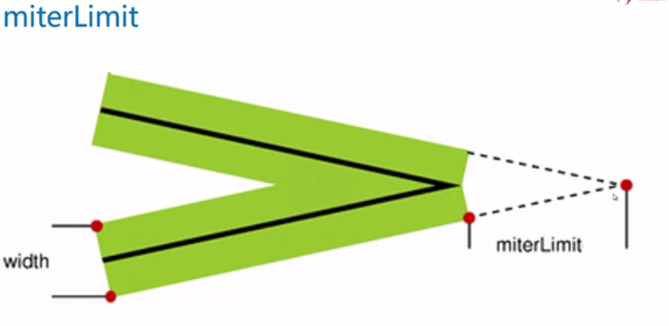

## 3.9 贝塞尔曲线（知道有）
***1. 绘制一条二次方曲线***

|      |                                                              |
| ---- | ------------------------------------------------------------ |
| 语法 | ctx.quadraticCurveTo(cpx,cpy,x,y);                           |
| 解释 | 绘制一条二次方曲线。微软的画图板中的曲线的颜色。             |
| 参数 | cpx： 贝塞尔控制点的 x 坐标<br />cpy： 贝塞尔控制点的 y 坐标<br />x ： 结束点的 x 坐标<br />y ： 结束点的 y 坐标 |

quadratic：二次方的意思， 英 [kwɒ'drætɪk]   美 [kwɑ'drætɪk]

Curve：曲线的意思， 英 [kɜːv]   美 [kɝv]

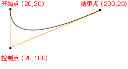

```js
ctx.beginPath();
ctx.moveTo(20,20);
//绘制2次方曲线，贝赛尔曲线
ctx.quadraticCurveTo(20,100,200,20);
ctx.stroke();
```

***2. 绘制一条三次贝塞尔曲线***

|      |                                                              |
| ---- | ------------------------------------------------------------ |
| 语法 | ctx.bezierCurveTo(cp1x,cp1y,cp2x,cp2y,x,y);                  |
| 解释 | 绘制一条三次贝塞尔曲线                                       |
| 参数 | cp1x: 第一个贝塞尔控制点的 x 坐标<br />cp1y: 第一个贝塞尔控制点的 y 坐标<br />cp2x: 第二个贝塞尔控制点的 x 坐标<br />cp2y: 第二个贝塞尔控制点的 y 坐标<br />x: 结束点的 x 坐标<br />y: 结束点的 y 坐标 |

提示：三次贝塞尔曲线需要三个点。前两个点是用于三次贝塞尔计算中的控制点，第三个点是曲线的结束点。曲线的开始点是当前路径中最后一个点。如果路径不存在，那么请使用 beginPath() 和 moveTo() 方法来定义开始点。

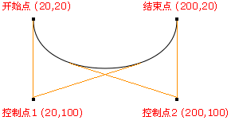

```js
//绘制复杂的贝塞尔曲线
ctx.beginPath();
ctx.moveTo(400,400);
//参数说明：context.bezierCurveTo(cp1x,cp1y,cp2x,cp2y,x,y);
// cp1x： 第一个贝塞尔控制点的 x 坐标
// cp1y： 第一个贝塞尔控制点的 y 坐标
// cp2x： 第二个贝塞尔控制点的 x 坐标
// cp2y： 第二个贝塞尔控制点的 y 坐标
// x: 结束点的 x 坐标
// y: 结束点的 y 坐标
ctx.bezierCurveTo(500, 200, 600, 600, 700, 300);
ctx.stroke();  
```
+ 案例：25绘制贝塞尔曲线.html

## 3.10 创建两条切线的弧（知道有）

|      |                                                              |
| ---- | ------------------------------------------------------------ |
| 语法 | ctx.arcTo(x1,y1,x2,y2,r);                                    |
| 解释 | 在画布上创建介于当前起点和两个点形成的夹角的切线之间的弧     |
| 参数 | x1:  弧的端点1的 x 坐标<br />y1:  弧的端点1的 y 坐标<br />x2:  弧的端点2(终点)的 x 坐标<br />y2:  弧的端点2(终点)的 y 坐标<br />r :  弧的半径 |
| 注意 | 类比：css3中的圆角。                                         |

```js
//代码demo：
ctx.beginPath();
ctx.moveTo(100,100);
ctx.lineTo(200,100);
//context.arcTo(x1,y1,x2,y2,r); //类比：css3中的圆角。
ctx.arcTo(240, 100, 240, 110, 40);
ctx.lineTo(240, 300);
ctx.stroke();   
```

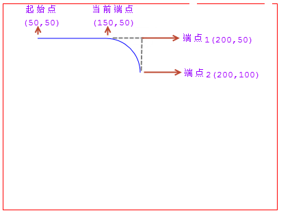

## 3.11 判断点是否在路径中（知道有）

|      |                                                              |
| ---- | ------------------------------------------------------------ |
| 语法 | ctx.isPointInPath(x,y);                                      |
| 解释 | 判断x,y坐标的点是否在当前的路径中。如果指定的点位于当前路径中返回 true；否则返回 false。 |

```js
context.isPointInPath(x,y);
//isPointInPath() 方法返回 true，如果指定的点位于当前路径中；否则返回 false。
//判断x,y坐标的点是否在当前的路径中。
```
## 3.12 文本宽度计算（知道有）

|      |                               |
| ---- | ----------------------------- |
| 语法 | ctx.measureText(text).width;` |

    context.measureText(text).width;

##  3.13 如果以后做canvas游戏方向开发深入学习可以扩展内以下容：

- setTransform() 将当前转换重置为单位矩阵。然后运行 transform()
- transform() 替换绘图的当前转换矩阵
- globalCompositeOperation 设置或返回新图像如何绘制到已有的图像上
- 像素操作

------

# 第4章 Canvas开发库封装
## 4.1封装常用的绘制函数
***1. 封装一个矩形***

思考：我们用到的矩形需要哪些绘制的东西呢？

1. 矩形的 x、y坐标
2. 矩形的宽高
3. 矩形的边框的线条样式、线条宽度
4. 矩形填充的样式
5. 矩形的旋转角度
6. 矩形的缩小放大

```js
//下面是把上面所有的功能进行封装的代码：
function ItcastRect( option ) {//矩形构造函数
    this._init(option);
}
ItcastRect.prototype = {  //矩形的原型对象
  _init: function( option ) {  //初始化方法
    option = option || {};
    this.x = option.x === 0 ? 0 : option.x || 100;
    this.y = option.y === 0 ? 0 : option.y || 100;
    this.w = option.w || 100;
    this.h = option.h || 100;
    this.angle = option.angle === 0 ? 0 : option.angle || 0;
    this.fillStyle = option.fillStyle || 'silver';
    this.strokeStyle = option.strokeStyle || 'red';
    this.strokeWidth = option.strokeWidth || 4;
    this.scaleX = option.scaleX || 1;
    this.scaleY = option.Y || 1;
  },
  render: function( ctx ) {//把矩形渲染到canvas中
    ctx.save();
    ctx.translate( this.x, this.y );//位移画布
    ctx.rotate( this.angle * Math.PI / 180 );//旋转角度
    ctx.scale( this.scaleX, this.scaleY );//缩放
    ctx.fillStyle = this.fillStyle;
    ctx.fillRect( 0, 0, this.w, this.h ); //填充矩形
    ctx.lineWidth = this.strokeWidth;     //线宽
    ctx.strokeStyle = this.strokeStyle;   //填充样式
    ctx.strokeRect( 0,0,this.w,this.h );  //描边样式
    ctx.restore();
  },
  constructor: ItcastRect
};
```

***2. 尝试着封装一个圆形？***

```js
//封装圆形的代码的答案：不要偷看
function ItcastCircle( option ) {
  this._init( option );
}
ItcastCircle.prototype = {
  _init: function( option ) {
    option = option || {};
    this.x = option.x === 0 ? 0 : option.x || 100;
    this.y = option.y === 0 ? 0 : option.y || 100;
    this.w = option.w || 100;
    this.h = option.h || 100;
    this.angle = option.angle === 0 ? 0 : option.angle || 0;
    this.fillStyle = option.fillStyle || 'silver';
    this.strokeStyle = option.strokeStyle || 'red';
    this.strokeWidth = option.strokeWidth || 4;
    this.scaleX = option.scaleX || 1;
    this.scaleY = option.Y || 1;
    this.opactity = option.opactity || 1;
    this.counterclockwise = 
      option.counterclockwise === true ? true : option.counterclockwise || false;
    this.startAngle = option.startAngle == 0 ? 0 : option.startAngle || 0;
    this.endAngle = option.endAngle == 0 ? 0 : option.endAngle || 0;
    this.startAngle = this.startAngle * Math.PI/180;
    this.endAngle = this.endAngle * Math.PI / 180;
    this.r = option.r || 100;
  },
  render: function( ctx ) {
    ctx.save();
    ctx.translate( this.x, this.y);
    ctx.scale( this.scaleX, this.scaleY );
    ctx.rotate( this.agnle * Math.PI / 180 );
    ctx.globalAlpha = this.opacity;
    ctx.fillStyle = this.fillStyle;
    ctx.strokeStyle = this.strokeStyle;
    ctx.moveTo(0, 0);
    ctx.arc( 0, 0, this.r, this.startAngle, this.endAngle, this.counterclockwise);
    ctx.fill();
    ctx.stroke();
    ctx.restore();
  },
  constructor: ItcastCircle
};
```

## 4.2 第三方库使用
+ [rgraph](https://www.rgraph.net/) vs 百度的echart：图表。
  + [zRender](https://ecomfe.github.io/zrender-doc/public/)：百度echarts底层库
+ [egret](http://developer.egret.com/cn/)：白鹭时代，游戏。国产的egret引擎
+ [treejs](https://threejs.org/)：3d库。比较火的3d引擎
+ [konva](https://konvajs.org/)：通用。特点：
  +  小巧、使用方便、适合移动端和pc端
  + 支持丰富的事件处理操作
  + 支持类似JQuery的操作方式（顺带能复习jQueyr）
  + 开源，可以随意更改
  + 社区更新比较活跃，github托管源码
  + 性能也不错
+ 其他的还有很多库。

------


# 第5章 Konva的使用快速上手
## 5.1 Konva的整体理念
+ 舞台的概念的引入。整个视图看做是一个舞台 stage
+ 舞台中可以绘制很多个层 layer
+ layer下面可以有很多的group
+ group下面可以有 矩形、图片、其他形状等

参看：快速上手文档---查看翻译文档

```
                  Stage
                    |
             +------+------+
             |             |
           Layer         Layer
             |             |
       +-----+-----+     Shape
       |           |
     Group       Group
       |           |
       +       +---+---+
       |       |       |
    Shape   Group    Shape
               |
               +
               |
             Shape
```

## 5.2 Konva 入门案例
***1. Konva 矩形案例***

|      |                                |
| ---- | ------------------------------ |
| 语法 | Konva.Rect(option);            |
| 解释 | rect是Konva 对象中的矩形对象。 |

```js
//Konva使用的基本案例
//第一步：创建舞台
var stage = new Konva.Stage({
  container: 'container',     //需要存放舞台的Dom容器
  width: window.innerWidth,   //设置全屏
  height: window.innerHeight
});

//第二步：创建层
var layer = new Konva.Layer();  //创建一个层
stage.add(layer);               //把层添加到舞台

//第三步： 创建矩形
var rect = new Konva.Rect({     //创建一个矩形
  x: 100,                     //矩形的x坐标，相对其父容器的坐标
  y: 100,                      
  width: 100,                 //矩形的宽度
  height: 100,                //矩形高度
  fill: 'gold',               //矩形填充的颜色
  stroke: 'navy',             //矩形描边的颜色
  strokeWidth: 4,             //填充宽度
  opactity: .2,               //矩形的透明度
  scale: 1.2,                 //矩形的缩放 1：原来大小
  rotation: 30,               //旋转的角度，是deg不是弧度。
  cornerRadius: 10,           //圆角的大小（像素） 
  id: 'rect1',                //id属性，类似dom的id属性
  name: 'rect',
  draggable: true             //是否可以进行拖拽
});

//创建一个组
var group = new Konva.Group({
  x: 40,      
  y: 40,
});
group.add( rect );  //把矩形添加到组中

//第四步： 把形状放到层中
layer.add( group ); //把组添加到层中
layer.draw();       //绘制层到舞台上
```

***2. Konva扇形案例***

|      |                                 |
| ---- | ------------------------------- |
| 语法 | Konva.Wedge(option);            |
| 解释 | wedge是Konva 对象中的扇叶对象。 |

wedge: 楔形

## 5.3 Konva的动画系统

***1. tween对象(重点)***

|      |                                                              |
| ---- | ------------------------------------------------------------ |
| 语法 | Konva.Tween(option);                                         |
| 解释 | tween 是控制 Konva 对象进行动画的**核心对象**。              |
| 参数 | tween 可以控制所有数字类型的属性进行动画处理，比如：x, y, rotation, width, height, radius, strokeWidth, opacity, scaleX 等 |

tween，英文意思：两者之间， 英 [twiːn]   美 [twin]

```js
var tween = new Konva.Tween({
    node: rect,             //要进行动画的Konva对象
    x: 300,                 //要进行动画的属性
    opacity: .8,            
    duration: 1,            //持续时间
    easing: Konva.Easings.EaseIn, //动画的动画效果
    yoyo: true,             //是否进行循环播放的设置
    onFinish: function() {
        //动画执行结束后，执行此方法
    }
});

tween.play();   //启动动画
```

tween的控制方法

* tween.play(),     //播放动画
+ tween.pause(),    //暂停动画
+ tween.reverse(),  //动画逆播放
+ tween.reset(),    //重置动画
+ tween.finish(),   //立即结束动画
+ seek：英文：寻找 英 [siːk]   美 [sik]

tween的缓动控制选项
* Konva.Easings.Linear            //线性
* Konva.Easings.EaseIn            //缓动，先慢后快
* Konva.Easings.EaseOut //先快后慢
* Konva.Easings.EaseInOut //两头慢，中间快
* Konva.Easings.BackEaseIn //往回来一点，然后往前冲，汽车启动类似...
* Konva.Easings.BackEaseOut
* Konva.Easings.BackEaseInOut 
* Konva.Easings.ElasticEaseIn  //橡皮筋 英 [ɪ'læstɪk]   美 [ɪ'læstɪk] 
* Konva.Easings.ElasticEaseOut 
* Konva.Easings.ElasticEaseInOut 
* Konva.Easings.BounceEaseIn   //弹跳；弹起，反跳；弹回  英 [baʊns]   美 [baʊns]
* Konva.Easings.BounceEaseOut 
* Konva.Easings.BounceEaseInOut 
* Konva.Easings.StrongEaseIn //强力
* Konva.Easings.StrongEaseOut 
* Konva.Easings.StrongEaseInOut 

动画效果参考： 

- 29Konva动画缓动效果案例.html

***2. 动画to的使用***

|      |                                        |
| ---- | -------------------------------------- |
| 语法 | Konva对象.to(option);                  |
| 解释 | to 就是对 tween 的封装，比较简单好用。 |

```js
//案例：
var rect = new Konva.Rect({
  x: 10,
  y: 10,
  width: 100,
  height: 100,
  fill: 'red'
});
layer.add(rect);
layer.draw();

//动画系统
rect.to({
  x: 100,
  y: 100,
  opactity: .1,
  duration: 3,
  onFinish: function() {

  }
});

//to: 就是对tween的简单应用。
```

***3. Animate的应用***

|      |                                                              |
| ---- | ------------------------------------------------------------ |
| 语法 | Konva.Animation(option);                                     |
| 解释 | Animation 动画，实际上就是浏览器通知开发者进行绘制，并提供当前的时间 |

```js
var anim = new Konva.Animation(function(frame) {
  //动画系统提供的frame有三个属性可以使用：
  var time = frame.time, // 动画执行的总时间
      timeDiff = frame.timeDiff, // 距离上一帧的时间
      frameRate = frame.frameRate; // 帧率（既1000/间隔时间）

  //动画的动作

}, layer);

anim.start();//启动动画

//anim.stop();//结束动画
```

***4. 循环播放动画的实现***

|      |                                                              |
| ---- | ------------------------------------------------------------ |
| 语法 | tween.onFinish(function(){})                                 |
| 解释 | 总体思路，使用tween 配合onFinish事件中重新播放动画，达到循环播放的效果 |

```js
//总体思路，使用tween 配合onFinish事件中重新播放动画，达到循环播放的效果
var loopTween = new Konva.Tween({
  node: star, //设置要表现动画的 Konva对象
  rotation: 360,  //旋转360度
  duration: 2,    //动画持续时间
  easing: Konva.Easings.Linear,
  onFinish: function() {
    // this === loopTween //true
    this.reset();//重置动画
    this.play(); //重新播放动画
  }
});
loopTween.play();
```
***5. 回放且循环播放动画***

|      |                                                              |
| ---- | ------------------------------------------------------------ |
| 语法 | tween.yoyo                                                   |
| 解释 | yoyo 属性可以进行对动画进行播放完后，回放当前动画，并持续循环来回切换播放。 |

```js
rect.to({
  duration: 2,
  scale: 1.5,
  yoyo: true// 此设置也可以用于 tween
});
```

### 5.3.1 进度条案例

### 5.3.2 传智官网案例
***1. 三角函数的补充***

* Math.sin(弧度); //夹角对面的边 和 斜边的比值
* Math.cos(弧度); //夹角侧边 与斜边的比值

***2. 圆形上面的点的坐标的计算公式***

* x =x0 + Math.cos(rad) * R;//x0和y0是圆心点坐标
* y =y0 + Math.sin(rad) * R;//注意都是弧度
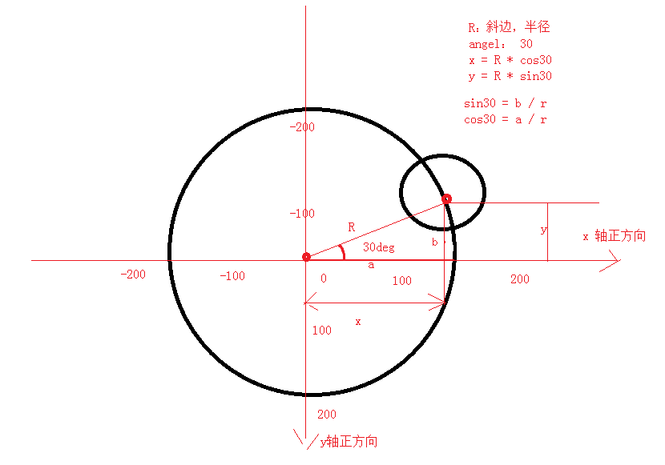

***3. group的灵活运用***

* konva的group很灵活，每个group都有自己的坐标系
* group可以包含其他的group，可以对group做整个组的动画
* group可以通过getChidren();//可以拿到直接子级元素。

```js
var group = new Konva.Group({
  x: 0,
  y: 0
});
group.add(rect);
```

## 5.4 Konva的事件（重要）

Konva支持事件

- mouseover, 
- mouseout, 
- mouseenter, 
- mouseleave, 
- mousemove, 
- mousedown, 
- mouseup, 
- mousewheel, 
- click, 
- dblclick, 
- dragstart, 
- dragmove, 
- dragend

类似JQuery的事件操作：

- rect.on('click', function(){})：绑定事件。
- rect.on('click mousemove', function(){})：绑定多个事件。
- rect.off('click');：解除绑定事件。
- rect.fire('click');：触发事件。
- evt.cancelBubble = true;：取消事件冒泡。

```js
var rect = new Konva.Rect({
  x: 100,
  y: 100,
  fill: 'red',
  width: 200,
  height: 200
});

//绑定事件 Konva支持事件：mouseover, mouseout, mouseenter, mouseleave, mousemove, mousedown, mouseup, mousewheel, click, dblclick, dragstart, dragmove, and dragend

rect.on('click', function(){   //jQuery一模一样！！
  console.log('^_^  ^_^');
});

//绑定多个事件
rect.on('click mousemove',function(e){

});

//解除绑定事件
rect.off('click');             //这不是jQuery吗？

//触发事件
rect.fire('click');

//取消事件冒泡
rect.on('click', function(evt) {
  alert('You clicked the circle!');
  evt.cancelBubble = true;      //取消事件冒泡
});
```

## 5.5 Konva的选择器
* ID选择法：stage.find('#id')，返回的是一个数组

  ```js
  stage.find('#id'); //此方法返回的是一个数组
  ```

* name选择法：group.findOne('.name')，返回一个Konva对象

  ```js
  group.findOne('.name');//返回一个Konva对象
  ```

* type选择法： group.find('Circle');，查找所有的圆形Konva对象

  ```js
  group.find('Circle');//查找所有的圆形Konva对象
  ```

```js
//组中查找圆形的Konva对象
groupCircle.find('Circle').each(function( circle, index ){
  circle.setZIndex( 3 - index );
});
```

## 5.6 Konva 进阶案例

***1. 饼状图案例***

|      |                      |
| ---- | -------------------- |
| 语法 | new PieChart(option) |
| 解释 |                      |

***2. 柱状图案例***

|      |                       |
| ---- | --------------------- |
| 语法 | new Histogram(option) |
| 解释 |                       |

histogram n. [统计] 直方图；柱状图  英 ['hɪstəgræm]   美 ['hɪstəɡræm]

------

# 第6章 Canvas项目实战

# 第7章 Canvas优化
```js
<!-- requestAnim shim layer by Paul Irish -->
  window.requestAnimFrame = (function(){
  return  window.requestAnimationFrame       || 
    window.webkitRequestAnimationFrame || 
    window.mozRequestAnimationFrame    || 
    window.oRequestAnimationFrame      || 
    window.msRequestAnimationFrame     || 
    function(/* function */ callback, /* DOMElement */ element){
    window.setTimeout(callback, 1000 / 60);
  };
})();


// example code from mr doob : http://mrdoob.com/lab/javascript/requestanimationframe/

var canvas, context, toggle;

init();
animate();

function init() {

  canvas = document.createElement( 'canvas' );
  canvas.width = 512;
  canvas.height = 512;

  context = canvas.getContext( '2d' );

  document.body.appendChild( canvas );

}

function animate() {
  requestAnimFrame( animate );
  draw();

}

function draw() {

  var time = new Date().getTime() * 0.002;
  var x = Math.sin( time ) * 192 + 256;
  var y = Math.cos( time * 0.9 ) * 192 + 256;
  toggle = !toggle;

  context.fillStyle = toggle ? 'rgb(200,200,20)' :  'rgb(20,20,200)';
  context.beginPath();
  context.arc( x, y, 10, 0, Math.PI * 2, true );
  context.closePath();
  context.fill();

}
```
